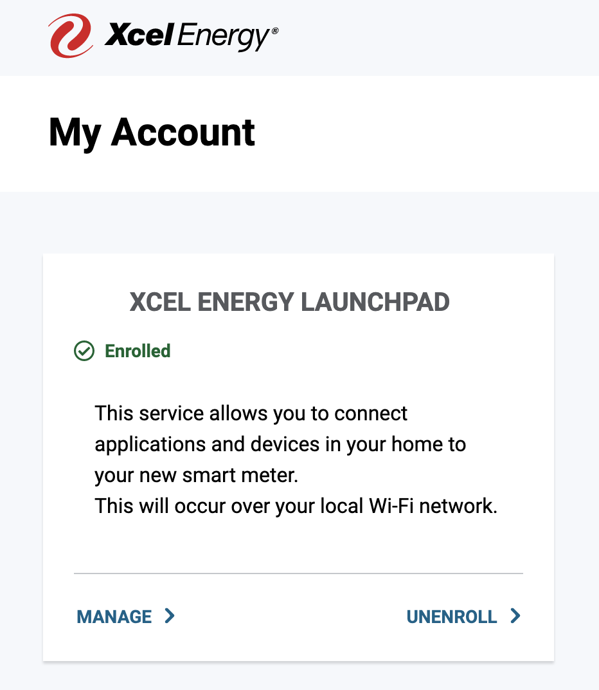
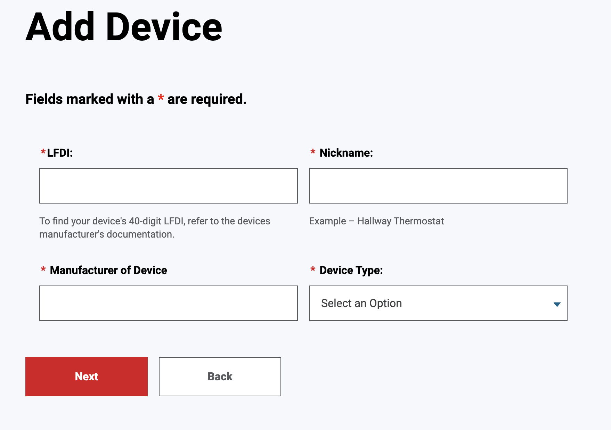
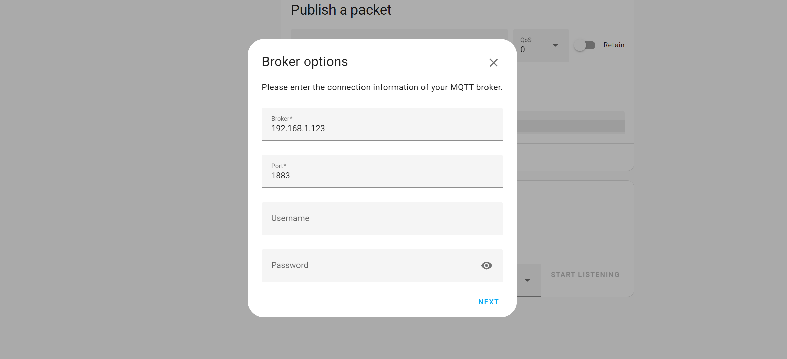

# Xcel Itron Smart Meter Home Assistant

This is a guide to capture data from an Itron smart utility meter (from Xcel energy) and send it to a local Home Assistant installation.

## Xcel Setup (from [brianthedavis/xcel-prometheus-monitor](https://github.com/brianthedavis/xcel-prometheus-monitor))

Start by generating a set of TLS certificates to securely communicate with the meter.  This command executes the `generate_keys.sh` script from the [zaknye/xcel_itron2mqtt GitHub repo](https://github.com/zaknye/xcel_itron2mqtt).

*Note -- this section will likely change as Xcel modifies their website over time...you may have to do some off-roading here*

1. Run this command from the location where this repo is cloned
    ```bash
    curl -s https://raw.githubusercontent.com/zaknye/xcel_itron2mqtt/main/scripts/generate_keys.sh | bash -s
    ```

    and will create a `certs` directory and output a formatted version of the cert's SHA256 fingerprint like:

    ```
    The following string should be used as your LFDI value on the Xcel website:
    69B39A3106A6D6B213AC1E265B15D57795571169
    ```

2. Open the [Xcel Energy website](https://my.xcelenergy.com/MyAccount/s/meters-and-devices/manage-meters-and-devices) and select `Edit Meters and Devices`
3. Enroll in Xcel Energy Launchpad
4. Once Enrolled in the Xcel Energy Launchpad, select the `Manage` button

    

5. If you haven't already, connect the meter to your WiFi using the `Edit` button.
   - It's recommended to setup a different network (different SSID and password) to connect the meter
6. Select `Add a Device` and enter the LFDI that was provided from the `generate_keys.sh` script in step 1.

    

    For all of the other options, you can provide whatever value makes sense to you; the only important part is the LFDI.

7. Once your WiFi is connected and you've added a device, you will need to wait ~1 week for Xcel to confirm your Launchpad Enrollment.  You'll receive an email confirming this (again - this take a week or more).

## MQTT and Xcel Itron Integration

Once fully enrolled in Xcel Energy Launchpad, you can now pull data from the meter, and begin the setup for Home Assistant.

1. Setup MQTT broker to recieve messages from `zaknye/xcel_itron2mqtt` by doing either of the following:

    * **(Recommended)** Install MQTT HA integration using https://www.home-assistant.io/integrations/mqtt/
    
    * If you're not able to use the MQTT HA integration (ex. Home Assistant is installed via docker), you can setup a Mosquitto container to act as a broker. Here's an example `docker-compose.yml`:
    
    ```yml
        version: '3.8'

        services:
            mosquitto:
                image: eclipse-mosquitto:2
                ports:
                    - 1883:1883
                    - 8883:8883
                    - 9001:9001
                volumes:
                    - ./mosquitto/config:/mosquitto/config
                    - ./mosquitto/data:/mosquitto/data
                networks:
                    - mosquitto
        networks:
            mosquitto:
                name: mosquitto
                driver: bridge
    ```

    If you're using a container, you would also need to setup the `MQTT` service in HA to listen those messages. Go to `Devices and Services` under settings, and click `Add Integration`. Search for `MQTT` and enter the details of your MQTT broker.

    

2. Run the `zaknye/xcel_itron2mqtt` container image to poll the Xcel Itron meter and forward messages to MQTT broker. Here's an example `docker-compose.yml`:

    ```yml
        version: '3.8'

        services:
        xcel_itron2mqtt:
            image: ghcr.io/zaknye/xcel_itron2mqtt:main
            restart: unless-stopped
            volumes:
            - ~/xcel_itron2mqtt/certs:/opt/xcel_itron2mqtt/certs
            environment:
            - MQTT_SERVER=<ip address of MQTT broker>
            - METER_IP=<ip address of Xcel Itron meter>
            - METER_PORT=8081
    ```

    > Note: If you plan on running the `zaknye/xcel_itron2mqtt` image on a rasberry pi, or non-x86 device, you will need to rebuild the container using the [Dockerfile](https://github.com/zaknye/xcel_itron2mqtt/blob/main/Dockerfile) in `zaknye/xcel_itron2mqtt`

## Home Assistant Setup

Once the MQTT and `/zaknye/xcel_itron2mqtt` is setup, it's time to setup Home Assistant to monitor the energy from the MQTT integration.

You should now have an entity called `sensor.current_summation_delivered_value` under `Settings` > `Devices & Services` > `Entities`. To setup the energy dashboard to listen use this entity, do the following:

1. Go to `Settings` > `Dashboards` > `Energy`.
2. Click the `ADD CONSUMPTION` button. Select the `sensor.current_summation_delivered_value` entity. 

## Prices and Tariff Guide

Coming soon ...